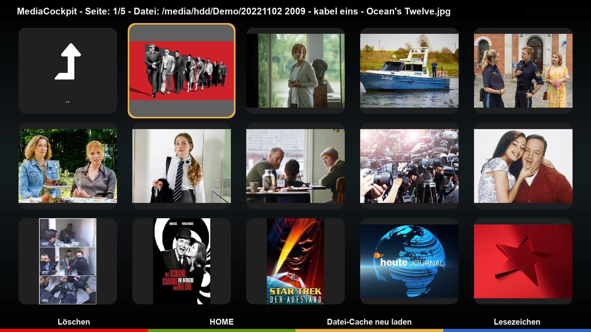
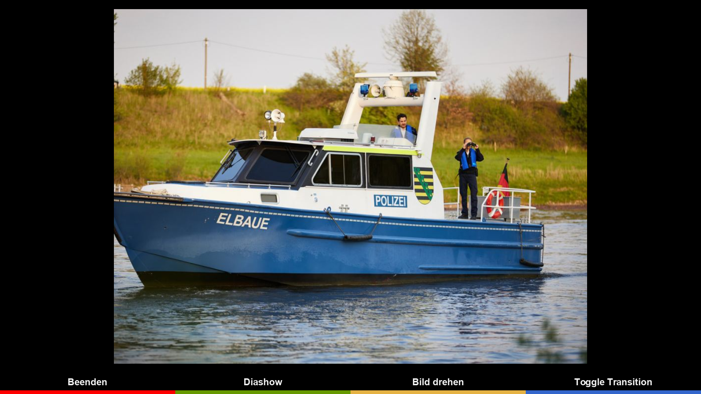

# MediaCockpit (MDC)
MDC is a plugin for browsing media content on DreamOs receivers. It utilizes an SQL database for quick data access and query functions (CacheCockpit).

# Functions
- Manual picture rotation
- Automatic picture rotation using Exif data
- Slideshows based on directories
- Slideshows based on playlists (.m3u)
- Animation in slideshows
- Mixed media content (pictures and videos) in directories or playlists
- Background music
- Music player

## Limitations
- MDC will not work properly on AIO images due to driver changes. For best experience please use unstable images.
- MDC supports DreamOS only
- MDC is being tested on DM 920 and DM ONE only

### Languages
- english
- german
- italian (by Spaeleus)

## Links
- Installation: https://dream-alpha.github.io/MediaCockpit
- Package feed: https://gemfury.com/dream-alpha
- Support: https://github.com/dream-alpha/MediaCockpit/discussions
