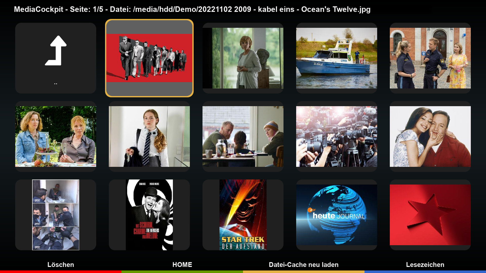
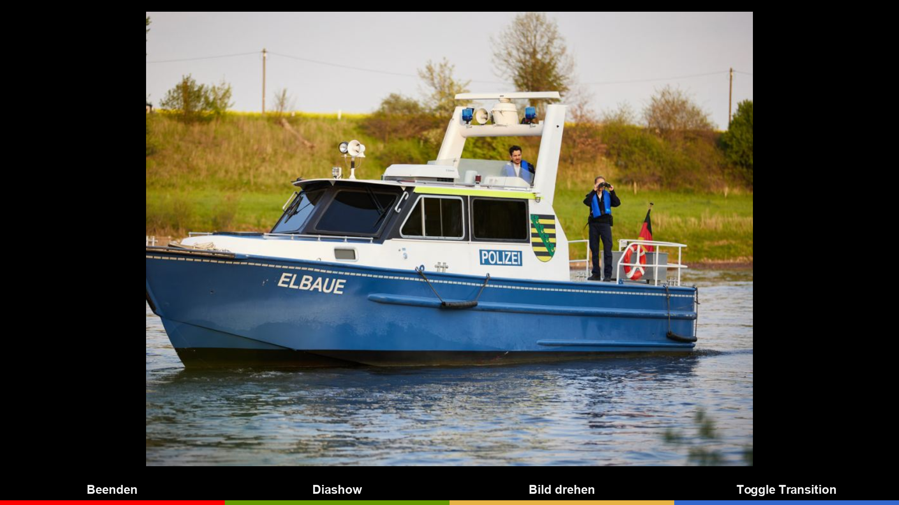

# MediaCockpit (MDC)

# Functions
- MDC is a plugin for browsing media files on DreamOs receivers
- Manual picture rotation
- Automatic picture rotation using Exif data
- Slideshows based on directories
- Slideshows based on playlists (.m3u)
- Animation in slideshows
- Mixed media content (pictures and videos) in directories or playlists
- Background music
- Music player
## Limitations
- MDC supports DreamOS only
- MDC is being tested on DM 920 and DM ONE only
## Installation
To install MediaCockpit execute the following command in a telnet console on your dreambox:
- apt-get install wget (required the first time only)
- wget https://dream-alpha.github.io/MediaCockpit/mediacockpit.sh -O - | /bin/sh

The installation script will also install a feed source that enables a convenient upgrade to the latest version with the following commands or automatically as part of a DreamOS upgrade:
- apt-get update
- apt-get upgrade

### Languages
- english
- german
- italian (by Spaeleus)

## Links
- Package feed: https://gemfury.com/dream-alpha
- Wiki: https://github.com/dream-alpha/MediaCockpit/wiki
- Support thread: https://github.com/dream-alpha/MediaCockpit/discussions
